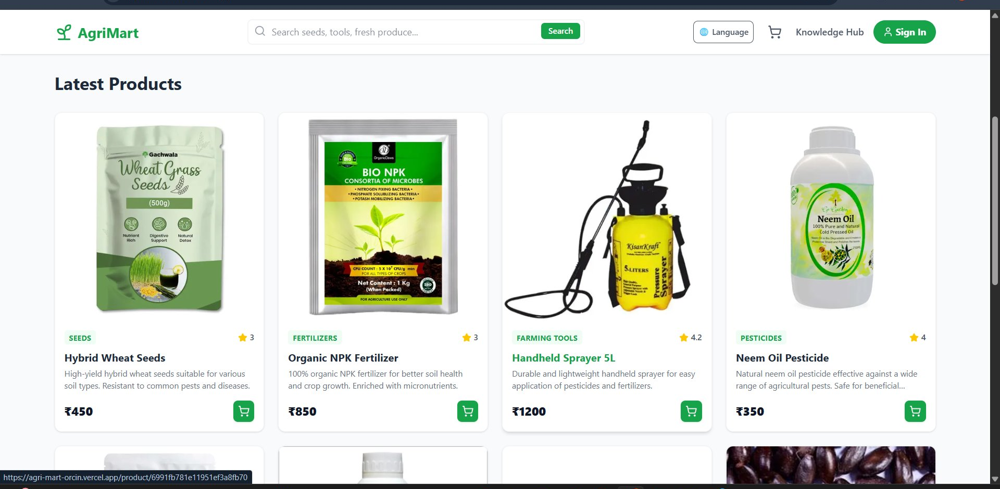
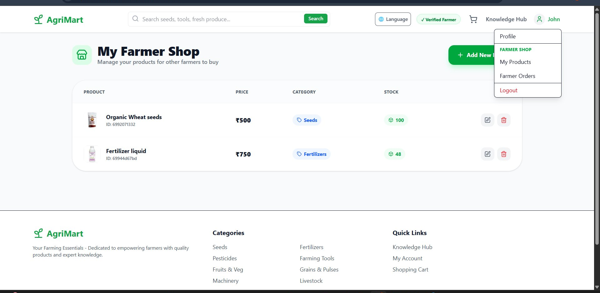
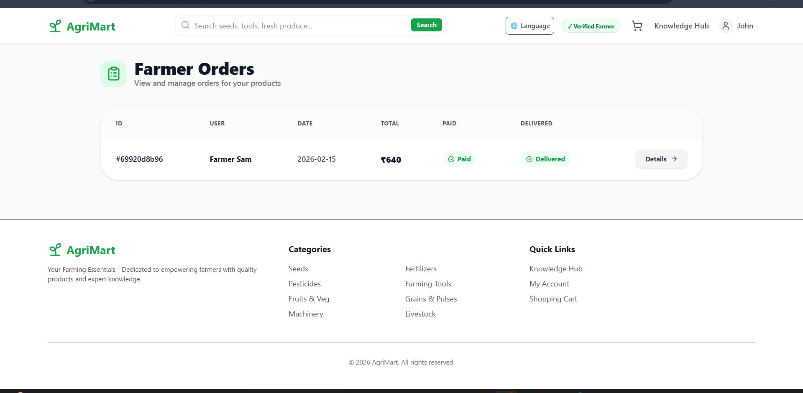
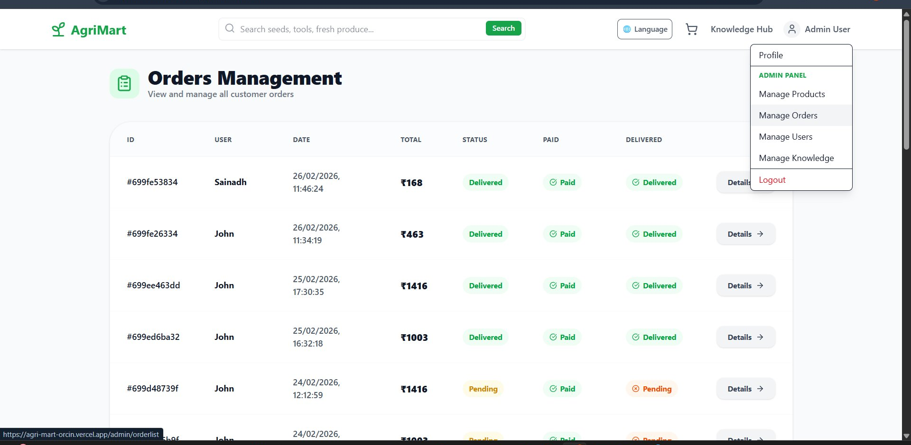
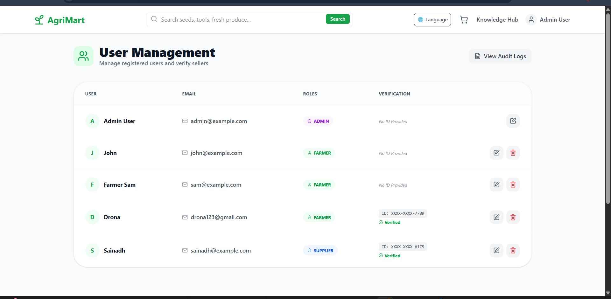

# 🌾 AgriMart

**An agricultural marketplace built for the farmers of Tadikonda, AP — where everyone buys, everyone sells, and no one gets cut out.**

---

## 🌱 The Story Behind It

Walk into any rural mandi in Andhra Pradesh and you'll notice something: farmers rarely get a fair price. There are too many hands between the field and the table — each one taking a cut.

AgriMart was built to fix that.

It's a full-stack MERN marketplace where farmers, suppliers, and consumers trade directly with each other. No brokers. No middlemen. Just five clean trading directions — Farmer↔Consumer, Farmer↔Supplier, Supplier↔Supplier, and more — where every person on the platform is both a buyer and a seller.

And because this is built for *rural* India, the whole thing works in **6 languages** — Telugu, Hindi, Tamil, Marathi, Bangla, and English — with payment options that work even if you've never owned a credit card.

---

## 📸 Screenshots

### 🏠 Home — Latest Products


### 🧑‍🌾 Farmer Dashboard — My Shop


### 📦 Farmer Orders


### 🔧 Admin — Orders Management


### 👥 Admin — User Management


---

## ✨ What It Does

### 🔐 Security you can trust
Nobody gets in where they shouldn't. The platform uses **JWT authentication** with role-based access control across 4 roles — Farmer, Supplier, Consumer, and Admin. Each role has its own dashboard and protected routes. Every admin action (who did what, from which IP, and when) is logged to MongoDB.

### 🛒 A marketplace that works both ways
Unlike typical e-commerce where you're either a buyer or a seller, here **you're both**. A farmer can buy seeds from a supplier in the morning and sell tomatoes to a consumer in the afternoon — all from the same account.

### 💳 Pay the way you want
Razorpay powers the checkout with support for **UPI, Cards, NetBanking, Wallet, and Cash on Delivery**. The multi-step checkout was designed to be simple enough for first-time online buyers.

### 🌐 Speak your language
Built-in i18n via React Context supports **6 regional languages**. Farmers in Tadikonda shouldn't have to navigate a marketplace in a language that isn't theirs.

### 🛠️ Admin Panel
Admins get a full control panel — manage users, products, and orders in real time, browse the audit log, and keep the platform running smoothly.

---

## 🧰 Tech Stack

| Layer | What's used |
|---|---|
| Frontend | React.js, HTML5, CSS3, JavaScript (ES6+) |
| Backend | Node.js, Express.js |
| Database | MongoDB |
| Auth | JWT + bcrypt |
| Payments | Razorpay |
| i18n | React Context |
| Dev Tools | Git, GitHub, VS Code, Postman |

---

## 📁 Project Structure

```
AgriMart/
├── .github/
│   └── workflows/
│       └── agrimart-ci.yml
├── backend/
│   ├── config/
│   ├── controllers/
│   ├── data/
│   ├── middleware/
│   ├── models/
│   ├── routes/
│   ├── uploads/
│   ├── utils/
│   ├── index.js
│   ├── seeder.js
│   └── package.json
├── frontend/
│   ├── public/
│   ├── src/
│   ├── index.html
│   ├── tailwind.config.js
│   ├── vite.config.js
│   └── package.json
├── .gitignore
└── README.md
```

---

## 🚀 Running It Locally

**You'll need:** Node.js (v16+), MongoDB, and a Razorpay account.

```bash
# Clone the repo
git clone https://github.com/Drona0113/AgriMart.git
cd AgriMart
```

**Backend setup:**
```bash
cd backend
npm install
```

Create a `.env` file inside `backend/`:
```env
PORT=5000
MONGO_URI=your_mongodb_connection_string
JWT_SECRET=your_jwt_secret_key
RAZORPAY_KEY_ID=your_razorpay_key_id
RAZORPAY_KEY_SECRET=your_razorpay_key_secret
```

```bash
npm start
```

**Frontend setup:**
```bash
cd frontend
npm install
npm start
```

Open `http://localhost:3000` and you're in.

---

## 👥 Who Uses It

| Role | What they can do |
|---|---|
| 🧑‍🌾 **Farmer** | Sell produce, buy from suppliers, track orders |
| 🏭 **Supplier** | Sell to farmers & consumers, buy from other suppliers |
| 🛍️ **Consumer** | Browse and buy directly from farmers |
| 🔧 **Admin** | Manage everything, monitor audit logs |

---

## 🌍 Languages Supported

Telugu · Hindi · Tamil · Marathi · Bangla · English

---

## 🔮 What's Next

- [ ] Real-time order notifications (Socket.io)
- [ ] AI-powered crop price prediction
- [ ] Logistics & delivery tracking
- [ ] Mobile app (React Native)
- [ ] A farmer community forum

---

## 👨‍💻 Built by

**Kaja Drona Venkata Sai Gopinadh**  
B.Tech CSE @ VVIT Guntur (2022–2026)  
📧 drona0442@gmail.com · 🔗 [GitHub](https://github.com/Drona0113)

---

*Made for the farmers who never got a fair deal. Hope this changes that, even a little.*